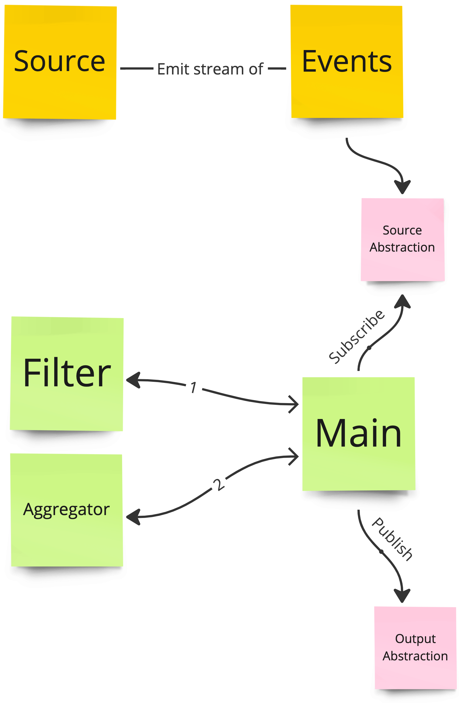

# Dynamic Events Aggregation

## Introduction

This is a test project to demonstrate how to aggregate events from different sources, filtering them, and performing
calculations.

## Getting started

### Prerequisites

- Node.js
- NPM

### Running the project

1. Install dependencies using `npm install`
2. Build the project using `npm run build`
3. Run the project using `npm run start`

## Requirements

<details>
<summary> Click to expand the assignment requirements </summary>

### Test Parameters

1. Have fun 🙂
2. Ask anything, I am here for any question you might have, don’t be shy
3. Duration is 3 hrs
4. Once completed, please compress the root directory of your solution to a .zip file and send to
   shaike.gross@gmail.com (make sure to delete node_modules directory before compressing)
5. Input file and events file are located here

### Required tools

- Node js
- Typescript
- IDE

### Review

In this task, you will be required to write code that “measures” a list of events based on predefined logic. Your code
will need to
Receive a Metric object.
Use the data in the Metric object to read a list of events
Use the data in the Metric to filter them
Use the data in the Metric to calculate a numerical value.
Save the numerical value

## Entities

### Metric

The Metric object contains all the logic that is needed to read, filter and calculate the
value from the events.

**Type Definitions**

```typescript
type Metric = {
    eventsDataSource: EventsDataSource
    filter: Filter;
    aggregationMethod: AggregationMethod;
};
```

### Event

The Event object contains an id, a timestamp and a “data” property of unknown structure.

**Type Definitions**

```typescript
type Event = {
    id: string;
    timestamp: Date;
    data: any;
}
```

### EventsDataSource

This property holds the information needed to read the events.
The events can be read from a local json file, an s3 file or a database.

**Type Definitions**

```typescript
const EVENTS_DATA_SOURCE_TYPE = {
    LOCAL_FILE_PATH: 'localFilePath',
    S3: 's3',
    DB: 'db',
} as const;


type EventsDataSourceType = typeof EVENTS_DATA_SOURCE_TYPE[keyof typeof EVENTS_DATA_SOURCE_TYPE];

interface LocalFileDataSourceConfig {
    path: string;
}

interface S3DataSourceConfig {
    url: string;
}

interface DbDataSourceConfig {
    connectionString: string;
    tableName: string;
}

type LocalFileDataSource = {
    type: typeof EVENTS_DATA_SOURCE_TYPE.LOCAL_FILE_PATH;
    config: LocalFileDataSourceConfig;
}

type S3DataSource = {
    type: typeof EVENTS_DATA_SOURCE_TYPE.S3;
    config: S3DataSourceConfig;
}

type DbDataSource = {
    type: typeof EVENTS_DATA_SOURCE_TYPE.DB;
    config: DbDataSourceConfig;
}

type EventsDataSource = LocalFileDataSource | S3DataSource | DbDataSource;
```

### Filter

The filter object is used to contain the logic that is used to filter out events before aggregating them.

The filter object contains conditions which contain criteria.

Criteria contain the comparison logic that should be executed to filter events.

The Criterion object the following properties:

- field - the name of the field on the event.data proeprty that should be used for comparison
- operator - the operator that should be used to perform the comparison (for example largerThan, equals, contains)
- value - the value to compare to.

Criterion Evaluation (With example)
The following criterion will filter all events where their amountPaid value is bigger than 5.

```typescript
const MoreThanFivePaidCriterion: Criterion = {
    field: 'amountPaid',
    operator: CRITERION_OPERATOR.LARGER_THAN,
    value: 5
}
```

If we apply this criterion to the following three events, only the second & third events will remain (make sure you
understand why)

```typescript
const events: Event = [{
    id: '1',
    data: {
        amountPaid: 1 // Lower than 5 so this event will be filtered out
    }
}, {
    id: '2',
    data: {
        amountPaid: 10 // Larger than 5 so this event will pass filter
    },
}, {
    id: '3',
    data: {
        amountPaid: 20 // Larger than 5 so this event will pass filter
    }
}]
```

Condition evaluation

	A condition is considered true for a given event, if *any* of its criterions are true for the event.

Filter evaluation

	A filter is considered true for a given event, if *all* of its conditions are true for the event.

**Type Definitions**

```typescript
type Filter = {
    conditions: Condition[];
};

type Condition = {
    criterions: Criterion[];
}

const CRITERION_OPERATOR = {
    EQUALS: 'Equals',
    NOT_EQUALS: 'NotEquals',
    LARGER_THAN: 'LargerThan',
    CONTAINS: 'Contains',
} as const;

type CriterionOperator = typeof CRITERION_OPERATOR[keyof typeof CRITERION_OPERATOR];

type Criterion = {
    field: string;
    value: any;
    operator: CriterionOperator;
};
```

### Aggregation Method

The aggregationMethod object is used to contain the logic that is used to calculate the number result from the filtered
events.

The Criterion object contains the following properties
field - the name of the field on the event.data property that will be used for the aggregation.
operator - the operator that should be used to perform the aggregation (for example sum, average, min)

Aggregation Example

	The following aggregation method will calculate an average of the field “amountPaid” for all events

```typescript
const averageAmountPaidAggregationMethod: AggregationMethod = {
    Operator: AggregationOperator.Average,
    Field: 'amountPaid'
}
```

If we apply this aggregation method to the following 2 events the result should be 15 (make sure you understand why)

```typescript
const filteredEvents: Event = [{
    id: '2',
    data: {
        amountPaid: 10
    },
}, {
    id: '3',
    data: {
        amountPaid: 20
    }
}]
```

**Type definitions**

```typescript
const AGGREGATION_OPERATOR = {
    SUM: 'sum',
    AVERAGE: 'average',
    MIN: 'min',
    MAX: 'max',
} as const;

export type AggregationOperator = typeof AGGREGATION_OPERATOR[keyof typeof AGGREGATION_OPERATOR];

type AggregationMethod = {
    operator: AggragationOperator;
    field: string
};
```

## Code Steps

1. Reading the events:
   You will start your code with predefined metrics found in a file, you will need to read a metric from there and based
   on
   the eventsDataSource property, read the events data. You only need to implement localFileEventsDataSource.

2. Measuring events value:
   Once you have the events you will need to filter them and run the aggregation method to get a numerical value

3. Save the results
   Now, you should have the result of the calculation, the events and the metric. You need to write an object called
   measurement which contains the metric, the events and the numerical value.You only need to implement writing
   measurement
   to console

Keep in mind that, though you are not required to implement this now, in the future the system will need to be able to
store/send the events any of the following endpoints

- A file
- DB
- An API
- A queue

## Important Notes

- Extensibility - write the code in a way that can be easily extensible to support future use cases of the flow.
- Separation - Make sure the code is well separated, in terms of coupling and well organised codebase.
- Readability - Make sure the code is easy to understand, try to avoid using low-context names for variables, function,
  files etc…
- Be you - The goal is to try and simulate how you tackle coding problems in a real life scenario, try and tackle it as
  if
  it was another task from your team lead. Ask questions, validate assumptions, make sure you understand the task

</details>

## Design

### Architecture

